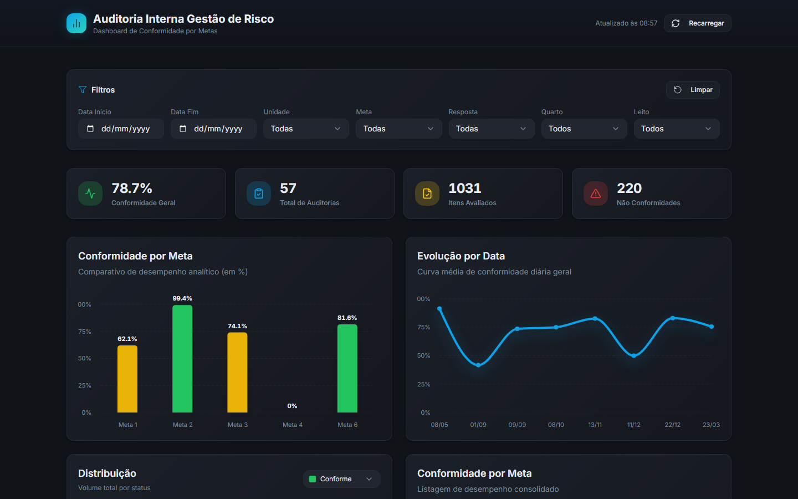

# 🏥 Dashboard de Auditoria Interna e Gestão de Risco
## Cateter Venoso e Sistema de Infusão - SCIH



## 📋 Sobre o Projeto

Este dashboard foi desenvolvido para auxiliar o Serviço de Controle de Infecção Hospitalar (SCIH) na auditoria interna de processos críticos, especificamente o uso de **Cateteres Venosos e Sistemas de Infusão**.

A aplicação transforma dados brutos de auditoria em visualizações interativas, permitindo que gestores e equipes clínicas identifiquem rapidamente falhas de conformidade, riscos potenciais e áreas de melhoria para garantir a máxima segurança do paciente.

---

## ✨ Funcionalidades Principais

- **📊 Monitoramento de KPIs**: Acompanhamento instantâneo de taxas de conformidade, total de auditorias e indicadores de criticidade.
- **🔍 Filtros Avançados**: Capacidade de filtrar dados por períodos específicos e unidades hospitalares.
- **📉 Visualizações Interativas**: Gráficos dinâmicos (Recharts) que mostram tendências temporais e distribuição de conformidade por setor.
- **📋 Auditoria Detalhada**: Lista completa de registros com status visual imediato e acesso rápido a detalhes de cada procedimento.
- **💡 Insights Automatizados**: Geração de cards de insights baseados nos dados atuais para suporte à tomada de decisão.
- **🌙 Interface Premium**: Design moderno em "Clinical Teal" com suporte total a Dark Mode, proporcionando uma leitura confortável e profissional.

---

## 🛠️ Tecnologias Utilizadas

Este projeto utiliza as tecnologias mais modernas do ecossistema React:

-   **Framework**: [React](https://reactjs.org/) + [Vite](https://vitejs.dev/)
-   **Linguagem**: [TypeScript](https://www.typescriptlang.org/)
-   **UI & Design**: [Tailwind CSS](https://tailwindcss.com/) & [Shadcn/UI](https://ui.shadcn.com/)
-   **Componentes**: Radix UI
-   **Gráficos**: [Recharts](https://recharts.org/)
-   **Gerenciamento de Dados**: [TanStack Query](https://tanstack.com/query) & [Zod](https://zod.dev/)
-   **Ícones**: Lucide React

---

## 🚀 Como Rodar o Projeto

### Pré-requisitos
- Node.js instalado (v18 ou superior recomendado)
- Gerenciador de pacotes (npm, yarn ou bun)

### Passos para Instalação

1. Clone o repositório:
```bash
git clone https://github.com/KaelBittencourt/dashboard-auditoria-interna-gestao-de-risco.git
```

2. Entre no diretório:
```bash
cd dashboard-auditoria-interna-gestao-de-risco
```

3. Instale as dependências:
```bash
npm install
```

4. Inicie o servidor de desenvolvimento:
```bash
npm run dev
```

---

## 📂 Estrutura do Projeto

```text
src/
├── components/      # Componentes UI reutilizáveis e Dashboards específicos
├── hooks/           # Custom hooks para lógica de negócio
├── lib/             # Utilitários e configurações (ex: utils.ts)
├── pages/           # Páginas principais da aplicação
└── App.tsx          # Componente raiz
```

---

## 📄 Licença

Este projeto é de uso restrito conforme as políticas internas da instituição.

---

*Desenvolvido com foco em Excelência Clínica e Segurança do Paciente.*
